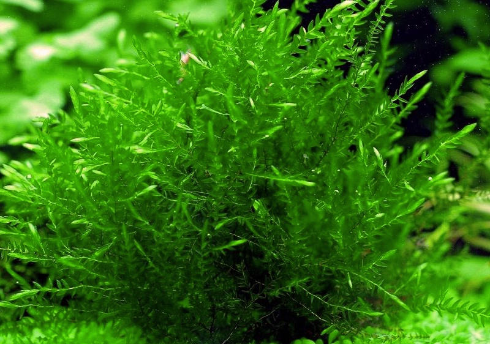
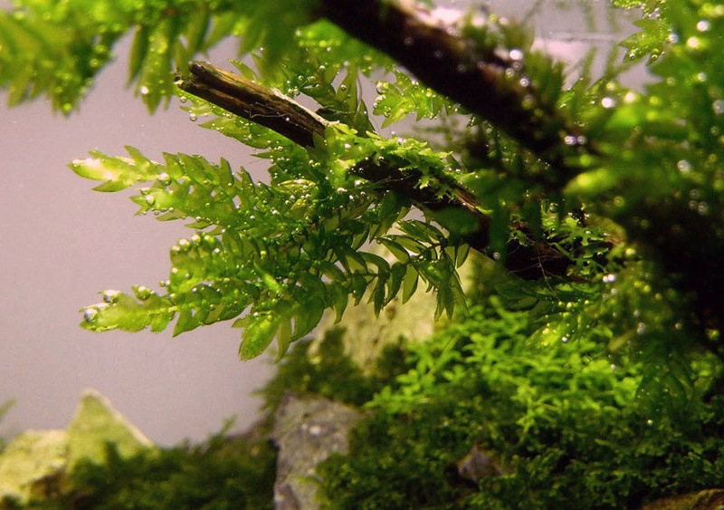

## General characteristics of mosses

You will probably agree that when we talk about mosses, we most often imagine low green bushes growing in swamps next to reddening cranberries or in a gloomy.

Mosses are common everywhere except in the seas and very saline soils. They cover the soil in tundra, coniferous forests and swamps with solid carpets. Some species of mosses in the process of evolution have successfully adapted to existence at the bottom of water bodies. Small mosses can settle on the bark of trees, on stones, even on sandy soil, forming dense sods, similar to picturesque green velvet, which does not lose its fresh attractive color at any time of the year.

Mosses can survive severe frost and drought, but they only grow and reproduce in the presence of heat and moisture.

The origin of mosses from the offspring of coastal algae has been proven. Long ago, the most ancient mosses "moved" to land from the aquatic environment, which was the cradle of life on Earth. But they did not become the direct ancestors of land plants. Some botanists ironically call mosses a rough draft of nature, considering this branch of the evolutionary scheme of the development of the plant world to be a dead end.

Not being the main, main line of development of the plant world on Earth, modern mosses, whose number is about 25 thousand species, occupy and firmly retain a special place in nature, have a noticeable effect on the habitat of many other plants and animals.

Almost all bryophytes are perennial herbaceous plants, only a few of their species are annuals.

The structure of mosses is quite simple. Leafy mosses consist of stalks covered with small leaves. Stems are absent in mosses, which belong to the class of liverworts; most of their species have a thallus, or thallus.

Mossy, as an independent department of higher plants, sharply differ from representatives of other departments of higher plants (spore, flowering and gymnosperms) in that the body of both leafy mosses and thallus is a sexual generation called gametophyte.

You have already learned about what a gametophyte is and what is its role in the life cycle of plants from the textbook “Biology. 7th grade. Diversity of Living Organisms ”.

Another interesting feature is that the bryophytes differ from their plant counterparts, manifested in the fact that the gametophyte as a sexual generation and the sporophyte as asexual form a single whole plant. The sporophyte is closely related to the gametophyte, develops on it, receiving nutrients from it.

Where is the sporophyte located? Looking at a well-developed moss specimen of any kind, we can notice small bolls that rise above the plant on thin legs.

The capsule and the leg, the lower, usually expanded part of which is introduced into the tissue of the gametophyte, is the sporophyte, which is called the sporogon in bryophytes. In different types of mosses

When the spores mature, the capsule is opened, and the spores are poured out and scattered by the wind. Moreover, each type of moss has its own methods of opening the spore-bearing capsules.

Most bryophytes range in size from 1 mm to several centimeters. Usually the height of ground mosses does not exceed 15–20 cm; there are species whose shoots grow up to 60 cm or more. And only shoots of water mosses from the genus Fontinalis (Fontinalis), which grow in running water, sometimes can have stems up to 90 cm long.

The short stature of most species of bryophytes is not accidental - water from the soil of mosses is obtained with certain difficulties, because they do not have real roots.

The absorption of water and attachment to the soil (or to any substrate: stones, bark, etc.) in mosses is carried out.
 
Stems and leaves can also absorb moisture from the environment.

Germinating in moist soil, spores first produce a primary moss thread, which is called protonema. In some species of mosses, spores begin to germinate already in the capsule. Growing up, the protonema forms an adult plant - the gametophyte. Botanists call the protonema "the youthful phase of gametophyte development."

The main function of the protonema is the mass formation of gametophytes, which create dense moss sod; with the help can be carried out.
 
A very interesting phenomenon is observed in some species of mosses, whose protonemes remain throughout the life of gametophytes. For example, the permanent protonema of Schistostega plumose moss has an amazing mysterious property - a night glow. Mosses of this species grow abundantly in the mountains of Central Europe, where a bewitching magical glow is observed in the crevices of rocks and in caves at nightfall.

